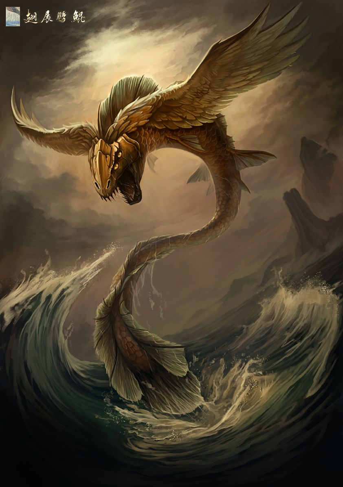
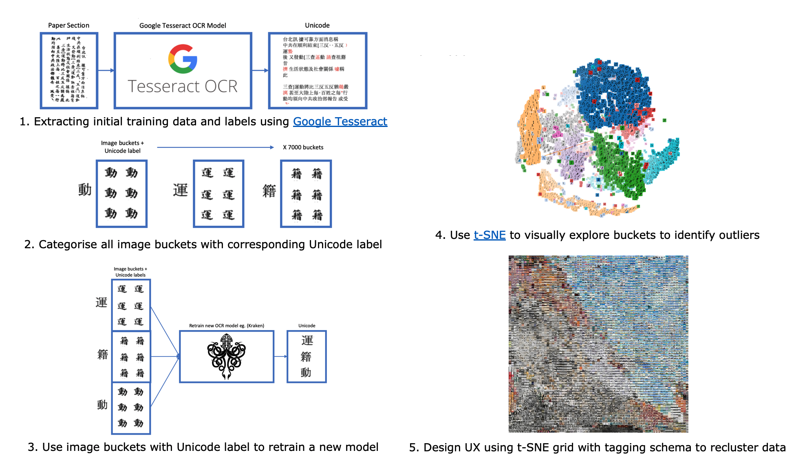
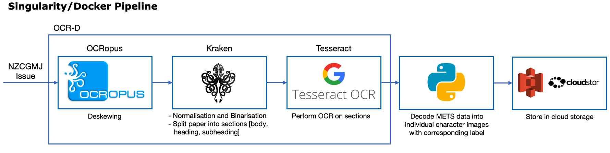
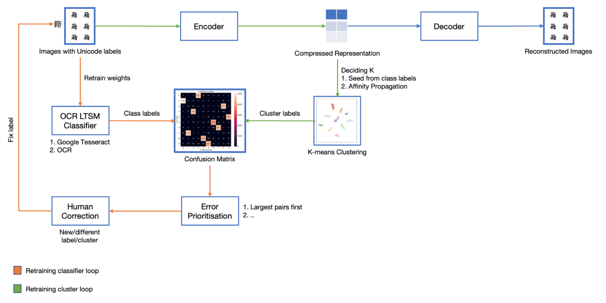

# [Kun](https://en.wikipedia.org/wiki/Peng_(mythology)) 鯤

A shape-shifter – a giant fish that can transform into a bird, a good omen





## Team

Charlene Leong - ENGR489 student  [charleneleong84@gmail.com]

Marcus Frean  - Associate Professor and ECS Supervisor [[Marcus.frean@ecs.vuw.ac.nz](mailto:Marcus.frean@ecs.vuw.ac.nz)]

Dr Sydney Shep - Waiteata Press Reader in Book History [[sydney.shep@vuw.ac.nz](mailto:sydney.shep@vuw.ac.nz)]

Rhys Owen - Waiteata Press Technical Lead  [[rhys.owen@vuw.ac.nz](mailto:rhys.owen@vuw.ac.nz)]

Ya-Wen Ho - Waiteata Press Publication Assistant and Language Expert [[ya-wen.ho@vuw.ac.nz](mailto:ya-wen.ho@vuw.ac.nz)]


## Content

1. Docs added as (Overleaf project) added as submodules
   - ```git submodule init```
   - ```git submodule update```

   - [Project Proposal](https://v2.overleaf.com/read/ssnghxggtttq) 
   - [Literature Review](https://v2.overleaf.com/read/ssnghxggtttq)


## Solution




#### OCR Preprocessing




#### Unsupervised Learning for Clustering Analysis

