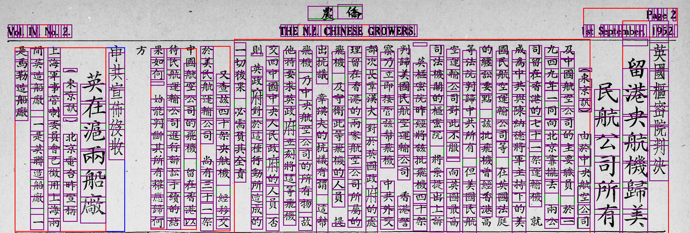

-  Google Cloud Vision API [Document Text Recognition](https://cloud.google.com/vision/docs/fulltext-annotations#making_the_api_request_and_reading_text_bounds_from_the_response) Tutorial
- [OCR](https://cloud.google.com/vision/docs/ocr) Tutorial
- [Setup](https://cloud.google.com/vision/docs/libraries#installing_the_client_library) Vision API

```bash
$ pip install --upgrade google-cloud-vision

$ export GOOGLE_APPLICATION_CREDENTIALS=credentials.json

$ python doctext.py sample.png -out_file out.png
```
Output Example!! :) :) 


TODO:
- Fix bounding boxes
- *Render output for comparison on kun app?